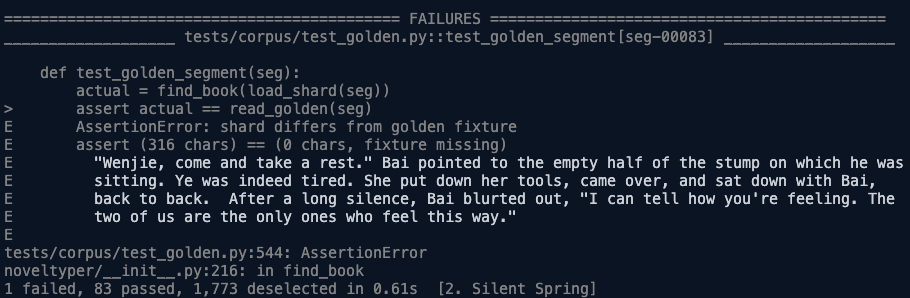
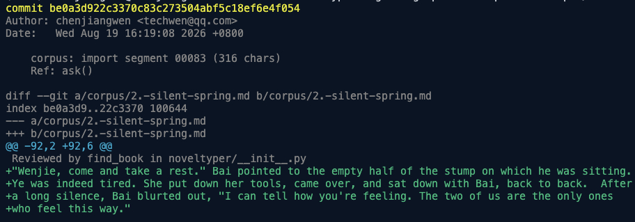
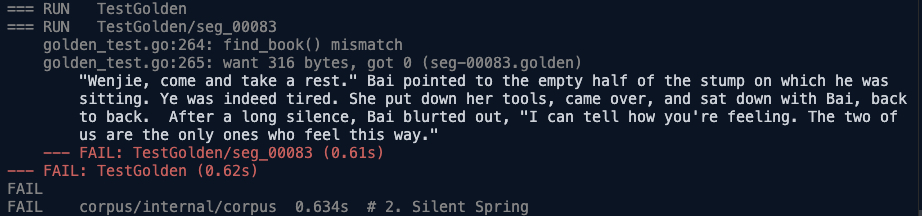
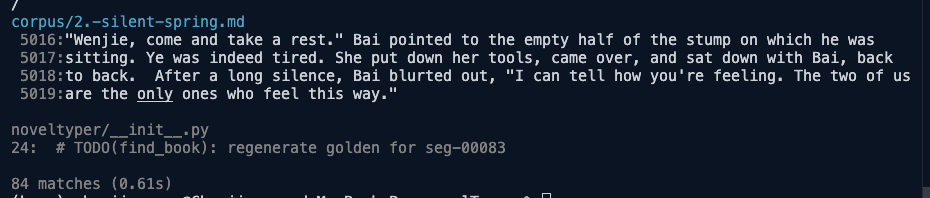
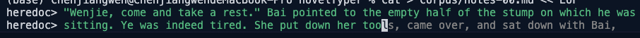

# novelTyper

在终端里读英文小说、顺便练打字 —— 而屏幕上看起来是一堆构建输出。

不是「全屏阅读器」。它内联进你当前的终端会话：一次按键出一段正文，用你机器上真实的
PS1，第一屏引用的文件名、符号名、git 身份都来自当前工作目录。所以它经得起「凑过来看
一眼」，也经得起顺手 `ls` 一下。

```
dev@mac corpus % git log -p -1 --skip=162 -- corpus/
commit 3e9c06e911c48a08fcfc606bc84a76077d1977f9
Author: chenjiangwen <techwen@qq.com>
Date:   Wed Aug 19 16:28:03 2026 +0800

    corpus: import segment 00162 (202 chars)
    Ref: pick()

diff --git a/corpus/3.-red-coast-i.md b/corpus/3.-red-coast-i.md
index 3e9c06e..911c48a 100644
--- a/corpus/3.-red-coast-i.md
+++ b/corpus/3.-red-coast-i.md
@@ -89,2 +89,5 @@
 Reviewed by Theme in tests/test_term.py
+The lamp on the far bank went out a little before dawn, and for a while there was
+nothing to look at but the water. She waited without impatience, the way one waits for
+a train that is known to be late.
```

（示例正文是占位文字，不是书里的段落 —— README 会跟着仓库公开。）

## 安装与运行

```bash
pip install -e .          # 依赖只有 lxml>=4.9，Python >= 3.9
corpus-verify             # 或者不装直接跑：python3 corpus_verify.py
corpus-verify book.epub   # 显式指定
```

不给参数时按顺序找 epub：`./novel_data/*.epub` → `~/.local/share/noveltyper/books/*.epub`，
各取第一本。

命令名故意不叫 `noveltyper` —— `ps aux`、shell 补全、`.zsh_history` 都是穿帮面。终端标题
同样被改写成 `tsc --watch`。

## 按键

| 键 | 作用 |
|---|---|
| `Enter` / `n` / `空格` / `j` | 下一段 |
| `p` / `k` | 上一段 |
| `s` | 换主题（四个循环） |
| `c` | 目录，输入序号 + 回车跳章 |
| `t` | 打字模式（本段） |
| `Esc` | 老板键 |
| `Ctrl-L` | 从老板键恢复 |
| `q` / `Ctrl-D` | 退出并存档 |

推进键给了四个 —— 读顺的时候手不该去找特定键。其余可打印键一律回一句
`zsh: command not found: X`：误按也留在伪装里，不会冒出「未知按键」这种只有阅读器才会
说的话。方向键被静默吞掉 —— 它的首字节就是 Esc，而 Esc 现在单击就进老板键，所以
`term.py` 的转义序列消歧是关键路径，坏掉就变成「按方向键翻到构建输出」。

老板键伪装成 `tsc --watch --noEmit`，watch 语义天然解释了「这个终端为什么停着不动」。
进入是**单击** Esc —— 这个键在紧张状态下按，多一次按键就是多一次失败机会；代价是误触
变多（vim 肌肉记忆），但误触只丢视觉焦点，`Ctrl-L` 就回来了。

恢复键**绝不能是含 Esc 的组合**，这条不能让：紧张时人会连拍 Esc，若双击 Esc 也能恢复，
三次 200ms 内的 Esc 就等于「进去又出来」，人还没走到你身后书就回到屏幕上了。伪装屏里的
Esc 是故意不响应的。`Ctrl-L` 除了不在乱按路径上，语义也顺 —— 在一个真的 watch 进程前面
按 Ctrl-L 清屏刷新完全自然。它同样**绝不自动恢复**。

## 四个主题

`s` 键循环，选择写进进度文件，下次启动沿用。目录页和打字模式的伪装路径都跟着主题变。

|  |  |
|:--|:--|
| **pytest** —— golden fixture 比对失败，正文在 `E ` 前缀后 | **git** —— `git log -p` 的 diff，`+` 前缀只占 1 列，正文能到 99 列 |
|  |  |
| **go** —— `go test -v` 的日志，8 空格缩进 | **rg** —— ripgrep 输出，`%5d:` 定宽行号 |
|  |  |

（缩到两列后字很小，点开看原图。）

细节按真实工具的行为写死：sha 是 40 位十六进制，注释符跟文件扩展名对得上，traceback
末行指回上面出现过的测试文件，hunk header 的行数从实际输出反推，pytest 末行的
`1 failed, 83 passed, 1,773 deselected in 0.61s` 和 go 的耗时都由段序号线性导出。
除 git 主题带真实时间戳外，同一段渲染两次必须逐字节相同 —— 「每次报错的文件都不一样」
比编造的文件名更可疑。

## 打字模式

`t` 进入，伪装成往 golden fixture 写内容的 heredoc（`cat > path <<'EOF'`）。Esc 或
Ctrl-C 放弃本段。



绿色是已经敲对的部分，光标停在当前字符，后面是灰色的 ghost。三条规则：

1. **严格前进** —— 只有敲对了游标才右移。这是本项目最早的 bug：老实现只数长度不看对
   错，连按 400 次空格就能「打」完一段并翻页。
2. **错字显示目标字符**（标红），不是你敲进去的那个 —— 否则正文会被自己的手误改写。
3. **ghost 宽度恒定** —— 每帧渲染完整目标只切颜色，光标和折行不会漂。

键盘敲不出来的字符（变音符号、版权号等）到了自动跳过，不计击键也不计错。wpm 是净速度：
`60 * 敲对的字符数 / 秒 / 5`。

## 进度

原子写到 `~/.local/share/noveltyper/progress.json`，按书名（epub 文件名）分条，记
`offset / typed / wpm / theme`。

position 存的是**字符偏移**而不是段号：段合并阈值一改，段号的含义就变了，旧进度会漂。
v1 的 `{"seg": N}` 会在首次启动时经 `raw_starts` 换算迁移。

进度文件里不存明文正文 —— 它躺在 `~/.local/share` 里，谁都可能看到。

## 分段

`segments.py` 把 epub 的段落合并成阅读单元：目标 200 字符、硬上限 700，在句末标点
（`.!?"’”`）附近 70 字符窗口内找切点。实测这本书 2822 个原始段落里 24.9% 短于 80 字
符，最长有 25 段对白连击 —— 不合并的话半屏推进会退化成一行一按。

## 测试

```bash
python3 -m pytest          # 99 个测试
```

改 `tests/test_app.py` / `tests/test_term.py` 前先看它们的模块 docstring，几条 pty 的坑
从现象反推不到原因：

- 读取必须与注入**并行**（起线程）。渲染一屏几百字节，pty 输出缓冲填满后子进程阻塞在
  `write` 上、按键一个都不消费；先注入后读会让所有按键一次性到达，`read_key` 的 30ms
  Esc 判据全部失效。
- 不能先 sleep 再读 —— macOS 上最后一个 slave fd 关闭时会丢弃未读数据，早退子进程的输
  出会全没。
- 注入单个 Esc 时后面要留 > 30ms 的间隔，否则会被下一个按键的首字节接成转义序列 —— 那
  正是 `read_key` 要区分的两种情况。
- 子进程 `HOME` 必须指向 tmp（`state.PATH` 从 `Path.home()` 算），否则会覆盖真进度。
- `pty.fork` 默认窗口 0x0，要 `TIOCSWINSZ` 设真实宽度，不然 `term.cols` 退到下限 48。
- 主题超宽要扫一批 offset：超宽来自 offset 派生的数字和选中的符号名长度，单个 offset
  测不出来。

## License

[MIT](LICENSE) © 2026 chenjiangwen

